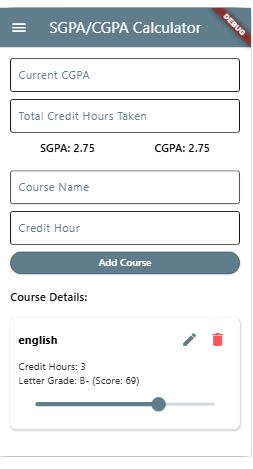

SGPA/CGPA Calculator based on Ethiopian grading System

A Flutter application that helps Ethiopian students calculate and plan their Semester GPA (SGPA) and Cumulative GPA (CGPA) based on the Ethiopian grading system.

Main Features
- Light and Dark mode themes
- Add, edit, and delete courses with credit hours and grades
- Automatic SGPA and CGPA calculation
- Ethiopian grading scale (A+, A, A-, B+, B, B-, C+, C, C-, D, F)
- Save and load data using SharedPreferences
- Displays last saved timestamp
- Help dialog with instructions and image support

I have used Ethiopian Grading System with the grades as follow you can also find this grades in the code:

| Score Range     |    Letter Grade  | Grade Point |
|-----------------|------------------|-----------------|
| 91–100          | A+               | 4.0             |
| 86–90           | A                | 4.0             |
| 81–85           | A-               | 3.75            |
| 76–80           | B+               | 3.5             |
| 71–75           | B                | 3.0             |
| 66–70           | B-               | 2.75            |
| 61–65           | C+               | 2.5             |
| 50–60           | C                | 2.0             |
| 45–49           | C-               | 1.75            |
| 40–44           | D                | 1.0             |
| Below 40        | F                | 0.0             |

## 📱 Screenshots

